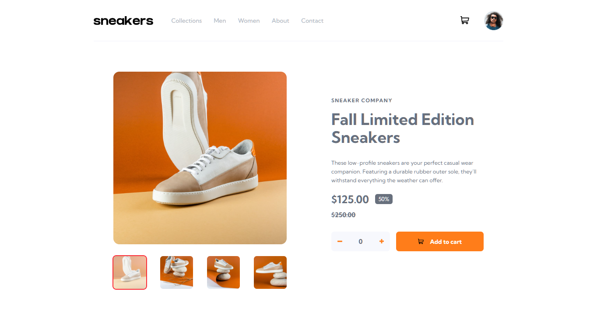

# 🛒 Frontend Mentor - E-commerce Product Page Solution



## 🚀 Overview

This is my solution to the [Frontend Mentor E-commerce product page challenge](https://www.frontendmentor.io/challenges/ecommerce-product-page-UPsZ9MJp6).  
The goal was to build a responsive, interactive product page that matches the provided design as closely as possible.

### 🔗 Live Demo
[View Live Site](https://ecommerce-product-page-main-psi-two.vercel.app)  
[Frontend Mentor Solution Page](https://www.frontendmentor.io/solutions/ecommerce-product-page-react-tailwind-dark-mode-and-lightbox-TvyBBlGPoQ)

---

## ✨ Features

- **Responsive layout** for mobile, tablet, and desktop
- **Dark mode toggle** with smooth transitions
- **Lightbox gallery** for product images
- **Thumbnail switching** for main product image
- **Cart functionality** (add, remove, view items)
- **Hover states** for all interactive elements
- **Pixel-perfect UI** with Tailwind CSS utilities

---

## 🛠️ Built With

- **React + Vite** ⚛️
- **Tailwind CSS** 🎨 for utility-first styling
- **CSS Variables** for theme colors
- **LocalStorage** to persist dark mode preference
- **Custom animations** with Tailwind keyframes

---

## 📚 What I Learned

- How to implement **dark mode** using Tailwind’s `darkMode: 'class'` strategy and persist it with React state + `localStorage`.
- Creating **smooth mount animations** with Tailwind custom keyframes.
- Handling **image galleries** with lightbox functionality and thumbnail switching.
- Importance of setting explicit `width`/`height` or `aspect-ratio` on images to prevent layout shifts.
- Structuring a React project for **scalable UI components**.

---

## 🚦 Getting Started

Clone the repo and install dependencies:

```bash
git clone https://github.com/ParthaDey5/ecommerce-product-page-main.git 
cd ecommerce-product-page
npm install
npm run dev
